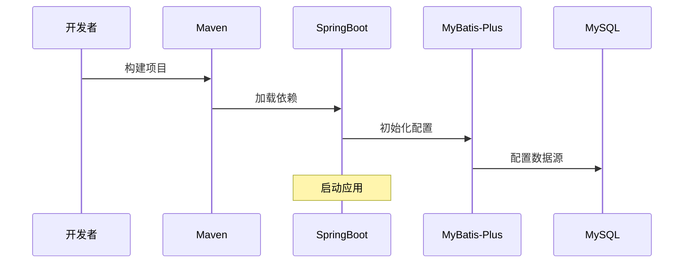

# 轻客管家 - 任务一安全审查报告

## 作者意图
搭建轻客管家项目的后端基础环境，包括：
- Maven 父工程（JDK17、SpringBoot 3.4.7、MyBatis-Plus 3.5.8）
- 子模块依赖配置
- 启动类
- 统一响应类（Result、PageResult）
- MyBatis-Plus 分页插件配置
- 全局异常处理器
- application.yml 配置

## 变更概览

**业务流程**


**技术流程**


## 安全审查发现

### 1. 数据库凭据硬编码

**位置**：`application.yml` [L8-L9]

**问题**：
数据库用户名和密码直接硬编码在配置文件中：
```yaml
username: root
password: root
```

**风险**：
- 生产环境数据库凭据泄露
- 版本控制系统中暴露敏感信息

**建议**：
使用环境变量或外部配置文件管理数据库凭据，避免硬编码。

### 2. 异常信息泄露

**位置**：`GlobalExceptionHandler.java` [L22]

**问题**：
系统异常直接返回完整错误信息：
```java
return Result.error("系统异常：" + e.getMessage());
```

**风险**：
- 暴露内部实现细节（如数据库表结构、SQL 语句）
- 攻击者可利用错误信息进行 SQL 注入或其他攻击

**建议**：
生产环境应返回通用错误信息，详细错误仅记录到日志。

### 3. SQL 注入防护缺失

**位置**：`MybatisPlusConfig.java` [L17-L21]

**问题**：
仅配置了分页插件，未配置 SQL 注入防护插件（如 `BlockAttackInnerInterceptor`）。

**风险**：
- 缺少全表更新/删除防护
- 开发人员可能误写危险 SQL

**建议**：
添加 `BlockAttackInnerInterceptor` 防止全表更新/删除操作。

### 4. 缺少输入验证

**位置**：全局配置

**问题**：
虽然引入了 `spring-boot-starter-validation`，但未配置全局验证拦截器。

**风险**：
- 未验证的用户输入可能导致 SQL 注入或业务逻辑漏洞

**建议**：
在 Controller 方法参数上使用 `@Valid` 注解，并确保全局异常处理器捕获 `MethodArgumentNotValidException`。

## 安全审查结论

| 编号 | 类别 | 标题 | 严重性 | 置信度 | 位置 |
|------|------|------|--------|--------|------|
| 1 | 敏感数据暴露 | 数据库凭据硬编码 | MEDIUM | 0.95 | [`application.yml:[8,9]`](file:///C:/Users/29730/Desktop/code/qingkeguanjia/web-Project/maven-project01/src/main/resources/application.yml#L8-L9) |
| 2 | 信息泄露 | 异常信息返回给客户端 | MEDIUM | 0.90 | [`GlobalExceptionHandler.java:[22,22]`](file:///C:/Users/29730/Desktop/code/qingkeguanjia/web-Project/maven-project01/src/main/java/com/qk/exception/GlobalExceptionHandler.java#L22-L22) |
| 3 | SQL注入防护 | 缺少 SQL 注入防护插件 | LOW | 0.85 | [`MybatisPlusConfig.java:[17,21]`](file:///C:/Users/29730/Desktop/code/qingkeguanjia/web-Project/maven-project01/src/main/java/com/qk/config/MybatisPlusConfig.java#L17-L21) |
| 4 | 输入验证 | 缺少全局输入验证配置 | LOW | 0.80 | 全局配置 |

**总结**：任务一的基础环境搭建代码整体质量良好，符合 SpringBoot + MyBatis-Plus 项目规范。发现 4 个安全相关问题，其中 2 个 MEDIUM 级别问题建议在生产环境部署前修复。

---

**审查人**：TRAE Code Review  
**审查时间**：2026-06-16  
**审查工具**：TRAE-security-review skill
